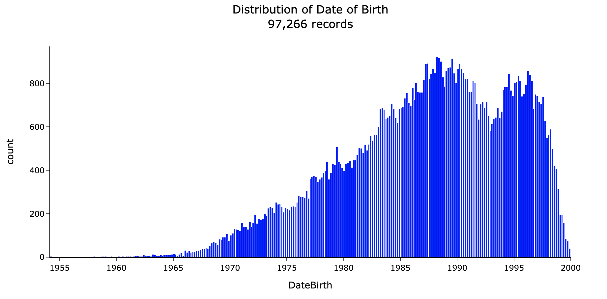
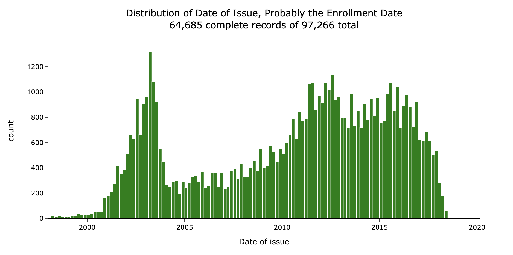
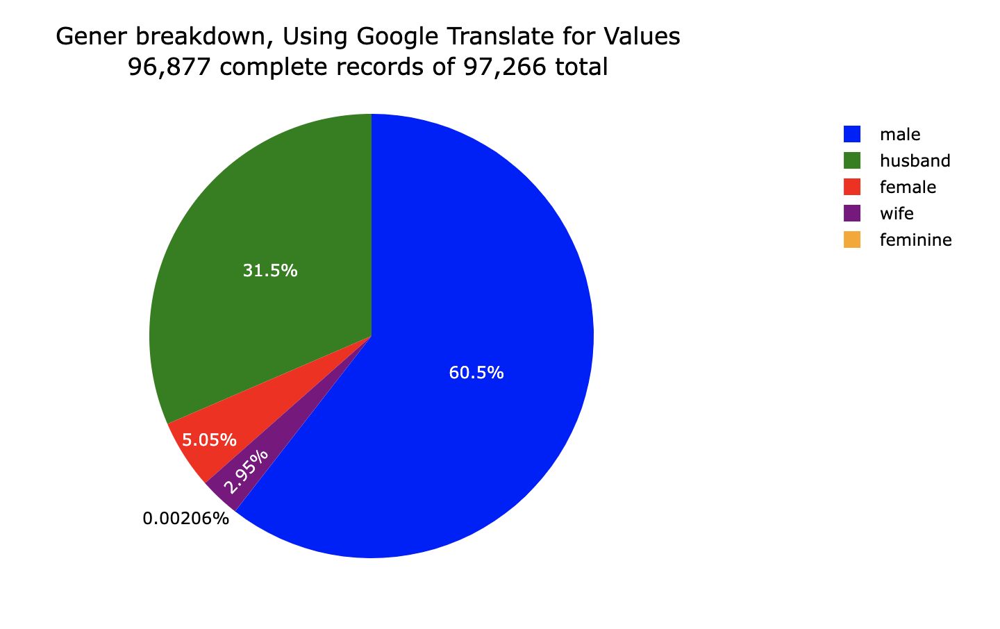

# Russian Servicemen fighting in Ukraine Data, Parsed

On 3/1/22 I saw [this post](https://www.reddit.com/r/worldnews/comments/t44ltl/personal_data_of_120000_russian_servicemen/) showing that the details of 120,000 Russian servicemen
fighting in Ukraine had been leaked. When I went looking for the actual
underlying data, all I found was a 6,000 page PDF.

I spent some time parsing and cleaning up the data into a hopefully more usable
format.  You cna see the actual process
[in this notebook](notebooks/extract_and_clean.ipynb).

You can find the original news article [here](https://www.pravda.com.ua/eng/news/2022/03/1/7327081/), the non-english one with the PDF imbedded
[here](https://www.pravda.com.ua/news/2022/03/1/7327081/), and the actual pdf either [in this repo](data/orcs.pdf) or [here](https://s3.documentcloud.org/documents/21280272/orcs.pdf).

## Data

The data are divided into three different tables.  Each of the tables has
97,266 rows, which is somewhat less than the 120,00 promised in the original
reddit post.

I made two versions:

- Raw, with minimal modification from the original:  [csv](output/raw/csv/)
- Cleaned, with mostly translated column names, a few translated values, and
  type changes:  [csv](output/clean/csv/), [parquet](output/clean/parquet/)
- Parsing code:  [notebook](notebooks/extract_and_clean.ipynb)

Its reasonable to suppose that the first row in each table type
refers to the same soldier, but I have not confirmed this yet. Some of the 
fields seem to line up.

## Teasers

## Parsing

The original data was in a PDF - I extracted the table on each page using
[tabula](https://pypi.org/project/tabula-py/) then parsed each page's table.
Three of the pdf pages could not be easily parsed

The parsing is imperfect: for three pages of the pdf I had to get it out
manually.  I included these files as csvs [in this folder](data/) so you can
check my work.

## Cleaning and Translating

The cleaning process was a slog, but here are the highlights.

### Raw Data

For the raw data, I kept everything as close to the original data as possible.
The one exception was table 2, where I removed some odd carriage returns in the
column names.

### Table Type 1

Changes during the cleaning:

- Converted `Tab Number` to an int
- Translated the column names:
  - `л.н` to `ID Number`, this is probably short for личный номер л.н.
  - `Таб.No` to `Tab Number`, this is probably another ID number, since its almost unique by row.
  - `Табельный номер` to `Name`, this obviously contains names.
  - `РПрс` to `RPRS`, unknown, translation from Google Translate.
  - `Раздел персо` to  `Personal Section`, unknown, translation from Google Translate.

### Table Type 2

This one was slightly dirtier.  Changes:

- Changed `DateBirth` to a date
- Translated `Gender`
- Removed letters from `Series`.  We don't do this to the `-` column since there seem to be some legitimate string values there.
- Made `-` a string column.
- Translated the column names:
  - `Категория сот` to `Cell category`, based on translated values looks like
  a general categorization of the kind of soldier, e.g. "Senior Officers" or
  "Solders, march."
  - `Наименовани` to `Rank`, Based on translated values.
  - `К люч пола` to `Gender`, based on contents looks like gender and marital status.
  - `ДатаРожд` to `DateBirth`, obviously contains dates.
  - `Подтип` to `Subtype`, unknown, looks like mixed content.
  - `Серия` to `Series`,  unknown, looks like mixed content.

### Table Type 3

- Removed alpha characters from `Date of Issue`.
- Converted a few columns to strings: `Id. room`, `ия`
- Translated the column names:
  - `Ид. номер` to `Id. room`, looks like another ID - mostly unique where it exists.
  - `Кем выдан` to `Issued by`, This one is frequently cut off but looks like some sort of associated organization.
  - `Дата выдачи` to `Date of issue`, might be the date the soldier joined, but messy.
  - `Код` to `Code`, tough to figure this one out - might be internal department codes for the Federal Migration Service.
  - `подразделен` to `Subdivision`, unknown, translation from Google Translate.

## Can anyone find the original file or help translate?

If anyone could find the _original_ file, not the pdf printout, I would greatly
appreciate it.  Based on the metadata of the PDF, it looks like it was printed
out using LibreOfficeDev 6.4.

Also, I don't speak Russian, so I had to translate using a combination of
Google Translate and searches for context.  If anyone speaks Russian or has a
working knowledge of Russian military bureaucracy your input would be very
helpful.

## Disclaimer

I didn't find the data originally, I just parsed the PDF I found.  I don't speak Russian so my translations are probably bad. I haven't verified that these data
represent what they claim to - they could be fabricated Russian propaganda for
all I know.  The code is messy, I promise to clean it up someday.

Don't use these data to harm anyone.
